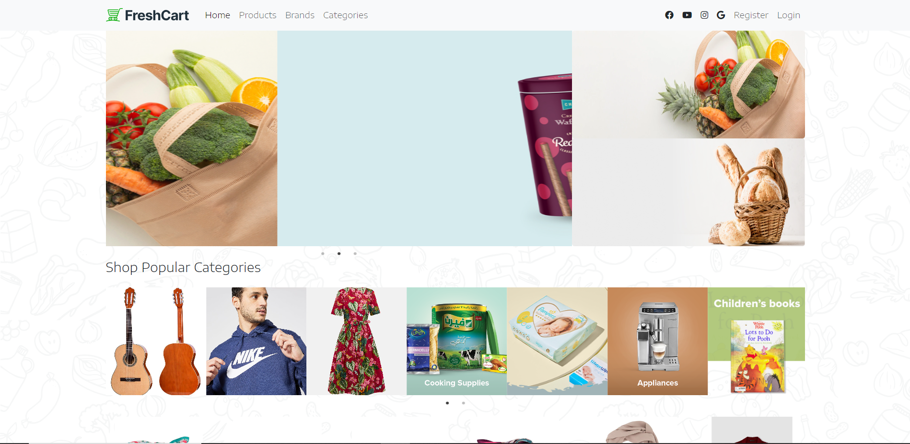
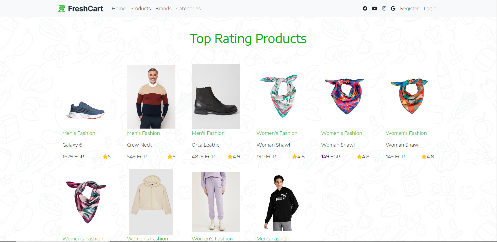
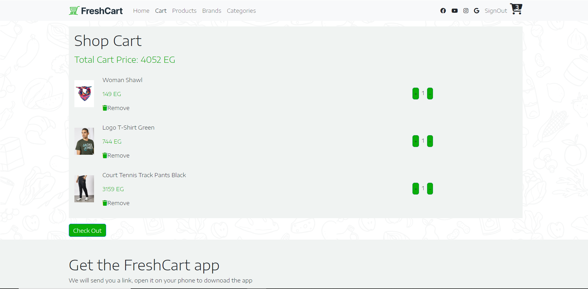

# E-commerce Website

This is a fully responsive e-commerce website showcasing products, categories, and a seamless user shopping experience. It includes a cart system, product filtering, and an intuitive UI built with modern front-end technologies, authentication, and authorization.

---

## Demo

You can check out the live demo of the project here:  
👉 [Live Demo](http://Asemyasser.github.io/E-commerce)

---

## Features

- **Interactive Product Listings**: Fetch and display products using API integration.
- **Shopping Cart**: Manage cart items with local storage for a smooth user experience.
- **Responsive Design**: Built with Bootstrap for a modern and responsive UI.
- **User Authentication**: Secure authentication and authorization for users.
- **Smooth Navigation**: Easy-to-use navigation and user-friendly interface.

---

## Technologies Used

- **Frontend**: HTML, CSS, JavaScript, React.js
- **State Management**: React Context API
- **Styling**: Bootstrap
- **API Integration**: Axios for fetching product details
- **Form Handling**: Formik and Yup for form validation
- **Animations**: Framer Motion for smooth animations
- **Routing**: React Router DOM for navigation
- **Other Libraries**: React Helmet, React Query, React Hot Toast, React Slick, React Spinners

---

## Installation

1. Clone the repository:
   ```bash
   git clone https://github.com/Asemyasser/E-commerce.git
   ```
   
2. Navigate to the project directory:
   ```bash
   cd E-commerce
   ```

3. Install dependencies:
   ```bash
   npm install
   ```
   
4. Start the development server:
   ```bash
   npm start
    ```

---

## Screenshots

### Home Page


### Product Listings


### Shopping Cart


---


## Acknowledgments

- **Route Academy**: For providing inspiration and resources for this project.
